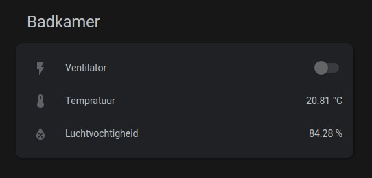

When I started out on automating my house I was checking various technologies to base this system on,
in the end I settled upon Zigbee which is a mesh network, so when device item can't directly communicate with the
driver it will run it along another device.  
So this means that every powered device is also a repeater of the signals.

So the bathroom is now the first room that has been automated,
the fan that removes the moist from the air now starts when it value goes above a threshold,
when it goes below it will switch off.

This is actually rather funny to start showering and then all of a sudden the fan will start running.

Still one temporary downside is that when the fan is running (which also repeater) is that the repeated signal almost stops
but this will be resolved when adding more devices to the network.

### Next step
The next step will be the living room for the lighting. Might add an automation rule to turn off the lights when
watching a movie, and turning it back on when the movie is paused or stopped. 

Will post an update when the rest of the hardware arrives!